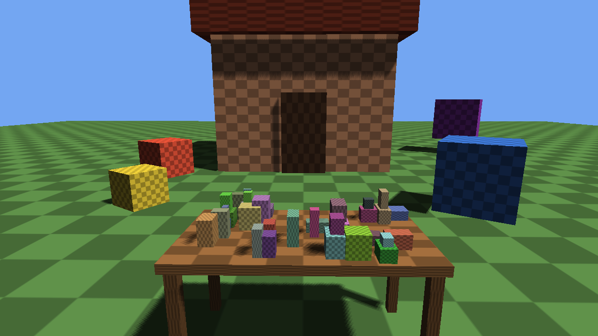

# daydrym

Tiny first-person GLES3 / OpenGL 3.3 demo: a house built from cubes, a table
piled with random cubes, and a few spinning cubes on a green floor, with
Blinn-Phong lighting, a shadow map and a procedural checkerboard texture.

A "hello world" starting point for VR experiments. It runs on the desktop
(SDL2) and on the **Lenovo Mirage Solo** (Google Daydream) through the archived
Google VR NDK; the same GVR build also works in Cardboard mode on phones.



*Desktop build (the headset renders the same scene, once per eye).*

## Desktop (Nix)

```bash
nix run github:…/daydrym          # once published
# or from a checkout:
nix build
./result/bin/daydrym
```

Controls:

- **WASD** — move
- **Mouse** — look
- **Space / Ctrl** — up / down
- **V** — cycle stereo modes (mono → SBS → SBS swapped → anaglyph red/cyan)
- **Esc** — release the mouse (click the window to grab it again)
- **Q** — quit (or close the window)

## Android / Daydream (Mirage Solo)

```bash
nix build .#daydrym-android        # → result/daydrym.apk (debug-signed, arm64-v8a)
adb install -r result/daydrym.apk  # uninstall first if the debug signature changed
adb shell am start -n com.daydrym/.DaydrymActivity \
    -a android.intent.action.MAIN -c com.google.intent.category.DAYDREAM
```

It also appears in the Daydream home. Requires Android 7.0+ (API 24) and
OpenGL ES 3.0.

Why GVR: the headset display belongs to the VR compositor, which only takes
buffers submitted through GVR. A plain SDL window ends up in the small
"2D in VR" panel, and a VR-mode surface without GVR is black. The SDK
(`sdk-base-1.200.0.aar`) is pinned and fetched by `flake.nix`; at runtime the
real implementation comes from Google VR Services.

Daydream controller:

- **Pointer** — a laser ray follows the controller (arm model)
- **Click / trigger** — teleport to where the ray meets the floor
- **Touchpad drag** — walk relative to where you are looking
- **App button** — toggle night / day lighting

The controller model lights up the touchpad (with a dot where you touch) and
buttons as you use them. See `mk/android/README.md` for packaging details.

## Status

- Desktop Linux works.
- Android (Mirage Solo, Android 8.0) works: stereo rendering, head tracking,
  controller.
- Not done: Cardboard tap-to-teleport fallback (no controller on phones),
  true 6DoF position, a textured floor / skybox. See `TODO.md`.

## License

GPL-3.0-or-later. See `LICENSES/` and the SPDX headers in source files.
